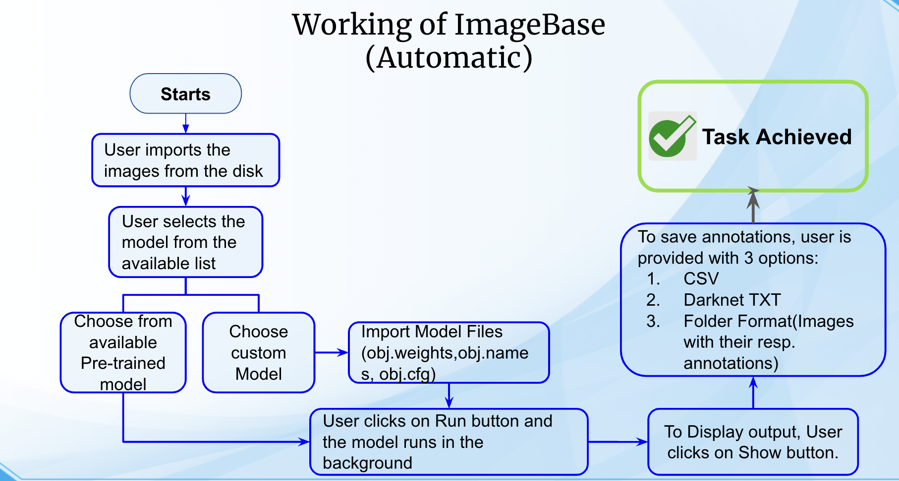
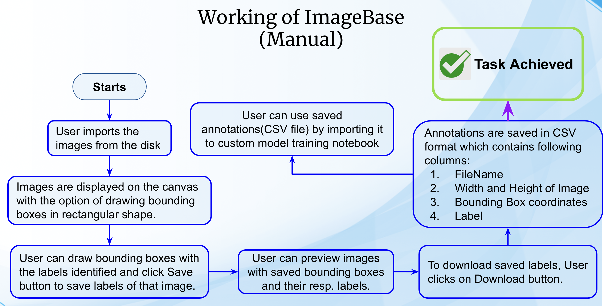
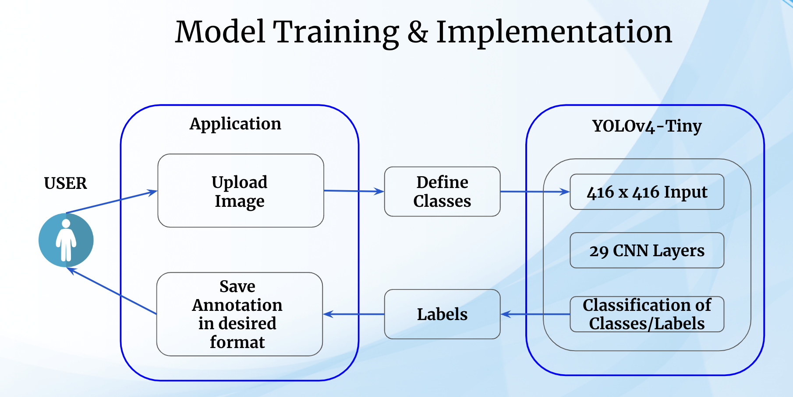

# ImageBase: Automatic Image Annotation tool
An user-friendly framework designed to streamline the image annotation process. This system automatically annotates images while also supporting manual annotation. Additionally, it incorporates user-trained custom models to assist developers in projects requiring object detection and classification.


## Run on local server:
```
1. Pull the code
2. Create a virtual environment with the `requirements.txt` file.
3. Run command "pip install -r requirements.txt"
4. Run command "python manage.py runserver"

```


#### -- Project Status: Completed

## Project Intro & Objective
As image collections continue to grow in size, manual annotation becomes impractical, necessitating accurate and time-efficient methods. This project addresses this challenge by introducing an Automatic Image Annotation system designed to label images from a large pool of unlabeled images automatically.

### Key Features:
1. **Automated Annotation**: Automatically labels images from unannotated datasets.
2. **Image Processing**: Utilizes image resizing for computational acceleration and employs image augmentation techniques.
3. **Evaluation**: Conducts experiments with various generic object detection algorithms and custom labeled datasets to assess system performance.
4. **Future Development**: Provides insights into further development directions for image annotation systems, drawing from both theoretical and experimental models.


### How are companies labelling their data today?
* Organizations use a combination of software, processes, and people to clean, structure, or label
data. In general, you have four options for your data labelling workforce:
* Employees - They are on your payroll, either full-time or part-time. Their job description may not include data labelling.
* Managed teams - They use vetted, trained, and actively managed data labellers (e.g. Cloud Factory).
* Contractors - They are temporary or freelance workers.
* Crowdsourcing - They use a third-party platform to access large numbers of workers at once.


### Project Assumptions:
* Model is trained on objects/classes required by the user.
* Quality of image fulfils the threshold value for detecting objects in an image.
* The number of images for training crosses the threshold for successful prediction.


### Project Limitations:
* The system will not work if low-quality images are given as input.
* The system will not predict the required class if the input number of that class do not cross the threshold.


### Project Objectives:
* To provide a user-friendly graphical interface to input the image.
* User should be able to upload the image
* The system should detect objects present in the image.
* The system should be able to Annotate the image with the near accurate bounding box
and their label.
* The system should export the annotations in required format.

### Methods Used
* Machine Learning
* Computer vision

### Technologies
* Python
* HTML/CSS
* Javascript
* OpenCV
* YOLO-V4 tiny
* Numpy, Pillow
* Django
* Ajax

## Project Workflow - Automatic Annotation


## Project Workflow - Manual Annotation


## Model Architecture


## Featured Notebook to Train Custom Model
* [Yolov4-tiny](./Yolov4tiny_CustomModel.ipynb)


